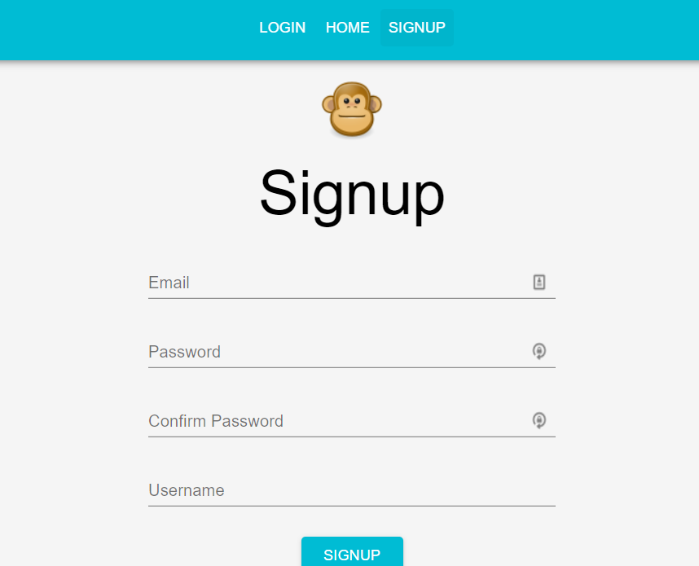

## Welcome to Echo!

# Screenshot of App

## DESCRIPTION

Echo is a Social Media app where users can post, leave comments, like, add profile information and images, and interact with friends.

This app can be viewed at: https://echo-726ac.firebaseapp.com/signup.

## TABLE OF CONTENTS

- [Description](#description)
- [Installation](#Installation)
- [Usage](#Usage)
- [Credits](#Credits)
- [Questions](#Questions)

## INSTALLATION

To install the dependencies necessary for this project, run the following command:

- npm i

## USAGE

- This project requires Requires node v14+ to run.

## CREDITS

- FreeCodeCamp.org was the inspiration/guidance behind this particular project.

## QUESTIONS

- If you have any questions, I can be reached through me email at slevalley@gmail.com. My GitHub profile can be viewed at at
  [sjlevalley](https://www.github.com/sjlevalley).
